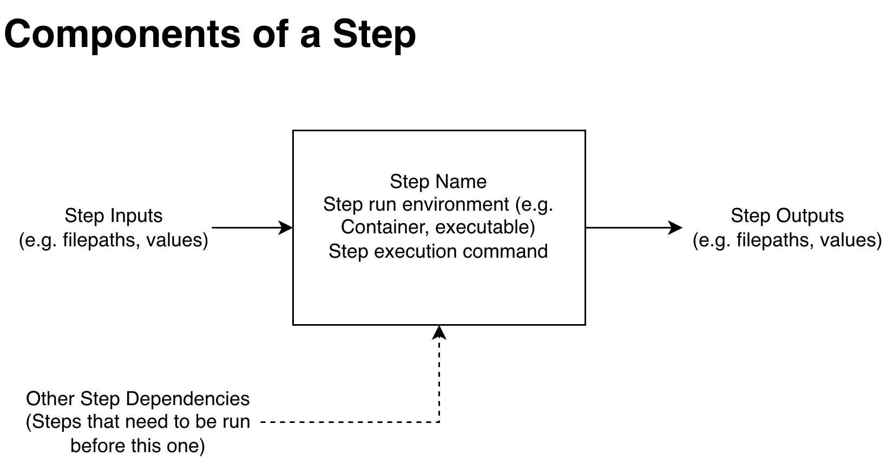
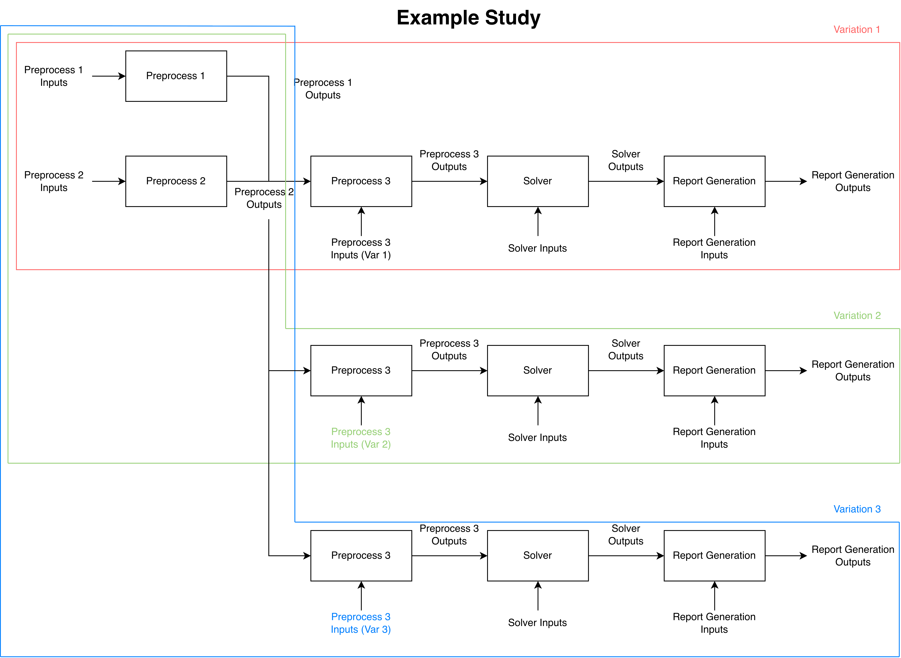

# ActaStudy User Guide

Version 0.3.0

> **NOTE: ActaStudy is currently under-developed, over-ambitious, and should be considered an experimental prototype at the moment. This User Guide serves as a roadmap of where the software is heading**

[1. Introduction](#1-introduction) \
[2. Installation](#2-installation) \
[3. System Support](#3-system-support) \
[4. Components of a Study](#4-components-of-a-study) \
[5. The Configuration File](#5-the-configuration-file)

## 1. Introduction

ActaStudy is a lightweight workflow orchestrator to manage computational studies. This includes a study configuration that allows for dependency tracking, variable insertion, and step tracking. It is designed to be straightforward to use, with a clear declarative style configuration file to define the study, and also allow for record-keeping of what the steps of the workflow are.

Specific use cases include:

- Designing and executing a research study with parameterized inputs
- Performing a sensitivity analysis using an existing workflow
- Setting up automatic regression testing so that when you make a file or input change, you can quickly audit what changes and where in the outputs
- Evidence bundling for archival or audit-friendly purposes

Specific use cases do *not* include:

- Resource aware submission and distributed computing --> use HPC software, e.g. SLURM
- Launching jobs based on load usage or time of day --> use a heavy orchestrator, e.g. Apache Airflow
- Create a central database of study management with gated human-checked tasks --> use an enterprise simulation process and data management, e.g. Ansys Minerva
- Determine which key output metrics should be tracked and compared across studies

In short, ActaStudy is for:
> Small research teams that want to automate their existing workflows with tooling that is lighter and more flexible than heavyweight enterprise-like solutions.

## 2. Installation

Prebuilt binaries are published as assets under the GitHub Releases. The installation process is download
the binaries locally, then put them along your command line path, or call them directly. These binaries are
self-contained and portable.

Release Builds are provided for Linux, MacOS, and Windows. However, only Linux and MacOS are actively tested while Windows builds
are done through the GitHub CI and are provided "as-is".

### 2.1 On Linux

On Linux, the personal folder is commonly at `~/bin` or `~/.local/bin`.

For ActaRecords:

``` bash
cp acta-study ~/bin
```

You can check that ActaStudy is on your path by trying to see its version

``` bash
acta-study --version
```

## 3. System Support

Linux is the primary supported deployment. Release build are built with Ubuntu, however, it is expected that the compiled binaries will work on any modern Linux-based system.

MacOS is also tested and supported.

Windows is released "as-is" and is built only via GitHub.

## 4. Components of a Study

At its core, the study is represented by a Directed Acyclic Graph (DAG), which describes how steps are dependent on one another and what needs to be run first.

If a single program execution (let's call it Step B) depends on results from another program execution (let's call it Step A), then we need to make sure that Step A is ran before Step B, otherwise dependent files may not exist or be out of date. Furthermore, if Step A uses a variable value that depends on which "run" you are on, then Step B also needs to inherit this dependency as the output of Step A may be changing per variable value. This entire process can be more generally referred to as orchestration.

Some terminology is needed to define how Studies are created and managed. Specifically, we look at the following terms:

- Step
- Branch
- Variation
- Study

### 4.1 Step

A Step is the smallest element of a Study that is tracked by ActaStudy. Other orchestration platforms may call this a Task.

Abstractly, it consists of inputs, execution, and an outputs. In the beginning, we referred to it as a program execution. In reality, this could be the execution of a single Python script, or a call to a Bash script. 

It is relatively arbitrary what to consider a Step. One could make an entire "run" a step, and each run produces a single output. From an scheduling point of view, this creates a larger "fixed object" making it hard to slot together as resources that are taken in a later part of the execution are being blocked earlier than is needed. *This is largely not a concern for ActaStudy (but rather for HPC clusters), as resources are not tracked nor optimized.* 

Instead, treat a Step as the most granular level of provenance available. That is, at what level do you want input and output files to be compared? If you have a giant Step, then you can't see granularly what changes and why.

In ActaStudy, the [templated strings](#52-templated-strings) within the [Configuration File](#5-the-configuration-file) are parsed to automatically detect dependencies. Using the String Templates is required for accurate expansion and dependency structure of the DAG.



*Figure 1: Components of a Step showing the black box nature of the inputs and outputs*

### 4.2 Branch

A Branch is a realization of Variable and its value. In the Design File, it is a single value.

It is named a Branch, because each of these variable-value pairs creates a branch on the graph. Each Variation is defined by a set of associated Branches, and each Step has associated Branches as well. 

*Table 1: representation of a Design File*
| run_id | var_x1 | var_x2 | var_x3 |
|--------|--------|--------|--------|
|    1   | 0.156  | "a24"  |  7     |
|    2   | 3.141  | "b21"  |  -13   |
|    3   | 2.441  | "z90"  |  2     |

In Table 1, a single entry e.g. (var_x1, 0.156) is a Branch. The Row would correspond to a Variation. A Step has 0+ Branches associated from it from the Variation.

While individual branches are uncommon to be examined, their Id is identified with a "Br" prefix.

### 4.3 Variation

A Variation is an isolated directed graph with chosen inputs at each branching point. This corresponds to a single line
in the Design File. A single Variation can share Steps with other variations, depending on how the Steps are set
up and where in the Variation a branching occurs. This reduces unnecessary computations.

This is especially prevalent in standard One Factor at a Time study designs, where parameters are held constant while only one is changed. This leads to several Steps that have the exact same inputs (and upstream inputs), thus if we naïvely ran each Variation independently, we would have ran the exact same Step with the exact same inputs and outputs


*Figure 2: Example Variations which show a branching behavior and shared upstream Steps*

Variations use their own internal hash-based ID which is indicated by a "V" prefix.

``` console
Variations
----------
V1b42bb03936edb68
  sleep_time "10"
V03f41d5e9f2c560b
  sleep_time "1.5"
```

### 4.4 Variation Step (VarStep)

If a Step represents the general inputs and outputs, the Branch represents singular variable-value combinations, and a Variation is all the Branches associated with a "run", what is the entity that is actually run?

That is the Variation Step. It represents a "realized" Step. A Step with all the values that it is dependent on, filled in. So, when you are looking at what steps are available to run or the status, we shouldn't look at the general Step, but the realized one with the specific variable inputs (Branches) that it is being ran with.

The VarStep is given an individual Id and is identified with a "vs" prefix.

``` console

  VarStepId          Step Name      Run Status
----------------------------------------------------
  vs2d82b4a357a90634 RunSolver      Not-Initialized
  vsa99d15d276a20b43 Postprocess_st Not-Initialized
  vsd7f88979d321342c Preprocess     Not-Initialized
  vs8e80463615a48d20 Postprocess_st Not-Initialized
  vs789bff3b753fb971 RunSolver      Not-Initialized

```

### 4.5 Study

A Study is all the Variations combined and represents the largest tracked entity by ActaTools. Study level
configuration, which describes the Variation directories and the inter-dependencies between the Steps. This description
is given in the `config.toml` file which should be placed at the study root directory.

The list of Variations contained in the study is described in the `design.csv` file. The `design.csv` file can be
created manually, or via the `acta design` interface which is described in more detail in the Command Line
Interface section of this document.

## 5. The Configuration File

The Configuration File is a declarative document that defines the Study parameters, and Steps.

It contains all the settings and run information related to the study. It is parsed to determine branching and Step dependency. It is formatted in Tom's Obvious Minimal Language (TOML) which is a minimal and readable format.

Parsing of the steps defines:

- Variables that need to be defined
- Step dependencies
- Branch dependencies, which are constructed from variable dependencies and step dependencies

### 5.1 The Design File

The design file is a comma-separated-value (CSV) file that defines the values of each of the Variations. Not all variables need to be included in the Study Configuration, but all variables in the Study Configuration need to be within the Design File. 

The Design File in [Section 4.2](#42-branch) would be written in the file as:

``` csv
run_id, var_x1, var_x2, var_x3
1, 0.156, "a24", 7
2, 3.141, "b21", -13
3, 2.441, "z90", 2
```

Note that white space values are ignored *unless they are within a string*.


### 5.2 Templated Strings

Templated strings are string values that use special templates to indicate run-time values. Currently, there are three main categories of templates:

1. Step references - references to files in another Step.
2. Variable references - values that are defined in the Design File
3. Shared references - values or files that are shared across the Study

#### 5.2.1 Step references

Step references are defined by `{steps.<StepName>.outputs}` and refers to the `<StepName>` belonging to the Branch dependencies of that particular Step. Step names are automatically resolved in the VarStep Uid when running.

#### 5.2.2 Variable references

Variable references are defined by `{variables.<VariableName>}` and refers to the `<VariableName>` value that is being used by that particular step. This is automatically resolved as the value defined in the Design File in VarStep.

#### 5.2.3 Shared references

Shared references are defined by `{shared}` and refer to the `shared` directory of the study (default is `/shared`). This is mainly used to indicate when common files are shared across Steps -- which helps with tracking and evidence bundling. In general, every file used by a Step, that is not specific to a particular run (e.g. a Step reference) should be put in `shared` as that allows for ActaStudy to be aware of the file. This file can then be relocated into local evidence bundles, if desired. 
